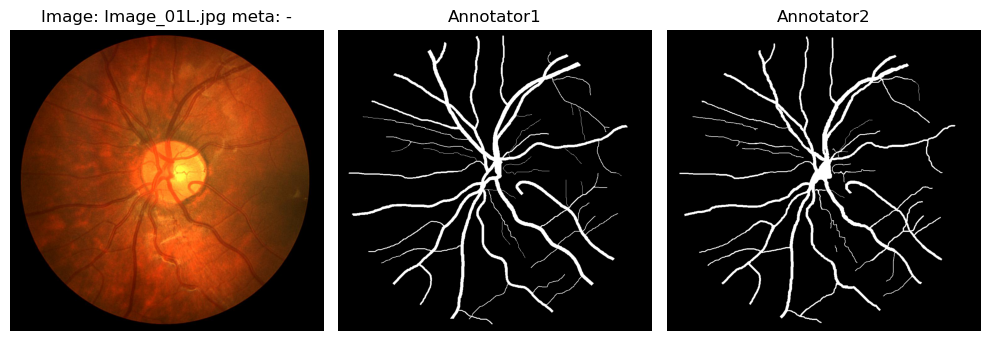
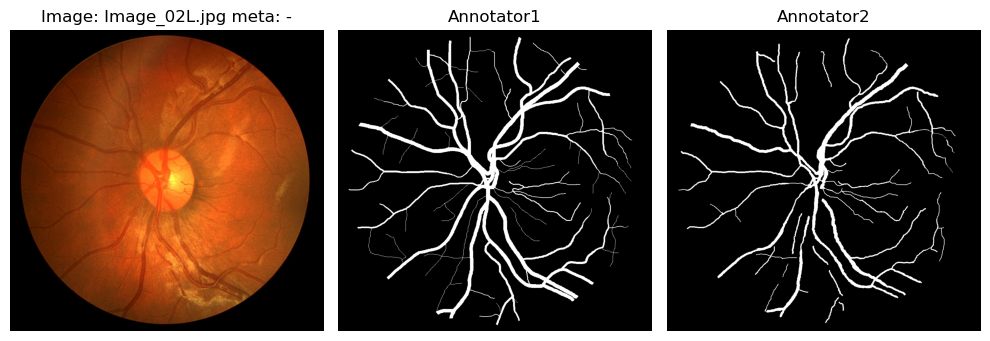
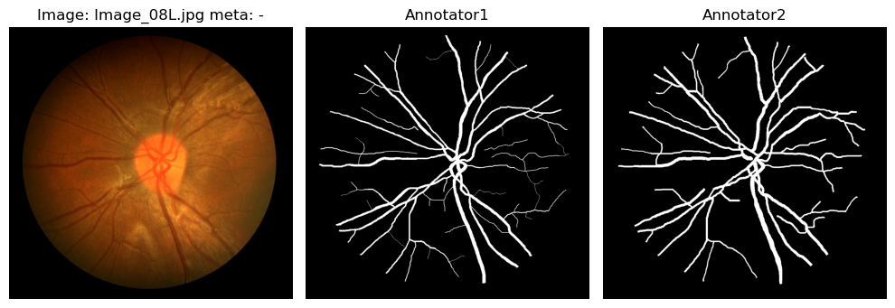
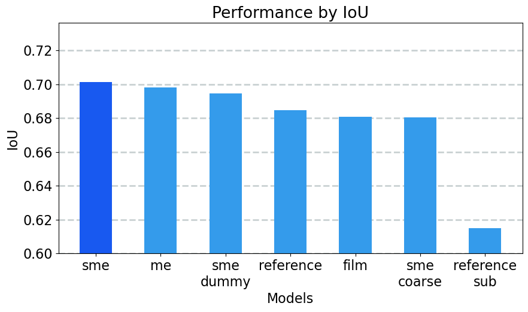
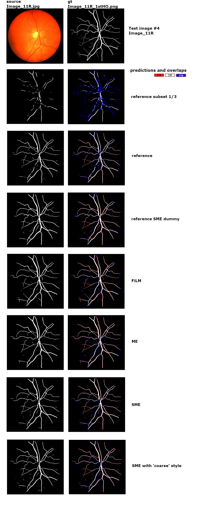

# Infusing metadata into CNN segmentation models through Squeeze-and-Excitation blocks
This repository is an official implementation of the MICCAI DART 2023 paper [Metadata Improves Segmentation Through Multitasking Elicitation](https://arxiv.org/abs/2308.09411)

## Installation

The code requires `python>=3.8`, as well as `pytorch>=1.7`.  Please follow the instructions [here](https://pytorch.org/get-started/locally/) to install PyTorch dependencies. The other few libraries are listed in the file `requirements.txt`, so they can be installed in bulk by 
```sh
git clone https://github.com/akvilonBrown/sme-metadata
pip install -r requirements.txt
pip install -e .
```
The last command is required for local dependencies to work across project folders and subfolders.

## Data
The installation doesn't include data. Please download it separately from the [Retinal image database](https://researchdata.kingston.ac.uk/96/) and unpack in the **data/CHASEDB1/** folder (or somewhere else, but the path should be specified in the configuration then).
The data contains RGB 28 images of retina and two corresponding sets of binary masks with segmented vessels from two annotators. A few samples of this data are below:





The annotation style of Annotator #1 was selected as ground truth.
The train/validation/test split is 18/4/6. In the train split six samples have fine masks from Annotator #1 (33%), the rest 12 have less detailed masks (67%). Validation and test sets have fine masks as a style to be aspired to. The description of the dataset is in the file **data/retina_data.csv**, which serves as a instruction for dataloader as well. Annotation styles are denoted with metadata labels 'FINE' and 'COARSE', which transform into hot-encoded labels [0,1] and [1,0] during training.

## Experiments
The experiments reproduce the simplified case from the paper [Metadata Improves Segmentation Through Multitasking Elicitation](https://arxiv.org/abs/2308.09411) with the segmentation of data having different annotation styles, where metadata helps the model to adopt certain target mask specifics and then to express the desired style during inference. Hence, with the lack of desired annotation style, the model still can benefit from the availability of data with other, subjectively less accurate annotation style and avoid "averaging" of styles. 

Each experiment runs in the dedicated folder that must have a **saved_models** subfolder for checkpoints. For this, the script **train_XX.py** should be launched with respective arguments or with default ones(the description of arguments is in the **utils/cli.py** file). The training saves checkpoint model **best_model.pt** and a series of empty files **best_model_00##.pt** with epoch number where checkpoints were saved - this is a sort of logging since training is relatively fast and a progress bar is used that doesn't stand interrupting with log messages. Upon training (100 epochs by default), the losses and learning rates are saved and plotted. The evaluation with the metrics saved is performed with the script **evaluate_XX.py**.

## Results

Metrics on the test data. The description of the models is in the paper. SME 'coarse' means prediction of SME model with 'incorrect' annotation style:

| Model/Experiment | IoU total| Dice total|
| ------ | ------ |------ |
| reference sub 1/3 |0.615 |0.762|
| reference |0.685 |0.813|
| SME dummy |0.695 |0.820|
| FiLM |0.681 |0.810|
| ME |0.698 |0.822|
| **SME**|**0.701** |**0.824**|
| SME 'coarse'|0.680 |0.810|

### Visuals

Bar plot:
<p float="left">
   
</p>

The visual comparison of predictions from various models on the test sample #4 is below:

<p float="left">
   
</p>


## Citing 
If you find the paper useful to your research, please consider citing:
```
@InProceedings{10.1007/978-3-031-45857-6_15,
author="Plutenko, Iaroslav
and Papkov, Mikhail
and Palo, Kaupo
and Parts, Leopold
and Fishman, Dmytro",
editor="Koch, Lisa
and Cardoso, M. Jorge
and Ferrante, Enzo
and Kamnitsas, Konstantinos
and Islam, Mobarakol
and Jiang, Meirui
and Rieke, Nicola
and Tsaftaris, Sotirios A.
and Yang, Dong",
title="Metadata Improves Segmentation Through Multitasking Elicitation",
booktitle="Domain Adaptation and Representation Transfer",
year="2024",
publisher="Springer Nature Switzerland",
address="Cham",
pages="147--155",
abstract="Metainformation is a common companion to biomedical images. However, this potentially powerful additional source of signal from image acquisition has had limited use in deep learning methods, for semantic segmentation in particular. Here, we incorporate metadata by employing a channel modulation mechanism in convolutional networks and study its effect on semantic segmentation tasks. We demonstrate that metadata as additional input to a convolutional network can improve segmentation results while being inexpensive in implementation as a nimble add-on to popular models. We hypothesize that this benefit of metadata can be attributed to facilitating multitask switching. This aspect of metadata-driven systems is explored and discussed in detail.",
isbn="978-3-031-45857-6"
}
```
